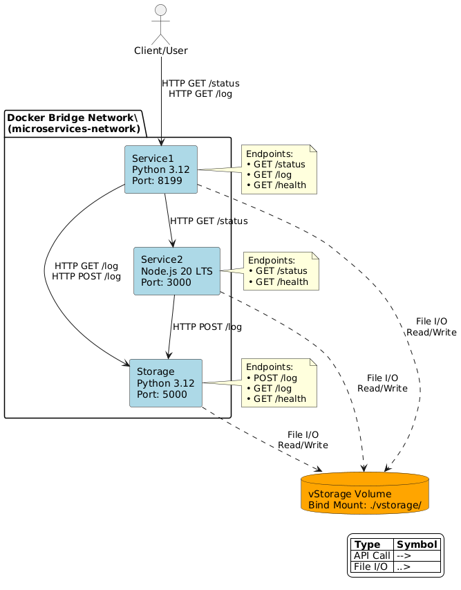

# Docker Compose Microservices Exercise Report

## Basic Information

### Platform Information
- **Hardware**: Apple Silicon Mac (ARM64 architecture)
- **Operating System**: macOS 24.6.0 (Darwin)
- **Docker Version**: Docker Desktop for Mac
- **Docker Compose Version**: v2 (integrated with Docker Desktop)

### System Architecture

The system consists of three microservices:

1. **Service1 (Python/Flask)** - Proxy service running on port 8199, acts as the external entry point
2. **Service2 (Node.js/Express)** - Status analysis service running on port 3000 (internal only)
3. **Storage (Python/Flask)** - REST API log storage service running on port 5000 (internal only)

## System Diagram



### Service IP Addresses (Docker Network)
- **service1**: 172.18.0.2 (accessible from host on localhost:8199)
- **service2**: 172.18.0.3 (internal only)
- **storage**: 172.18.0.4 (internal only)

## Analysis of Status Records

### System Status Measurements

The system successfully captures the following metrics:

1. **Uptime**: Measured in hours using system boot time
   - Service1 (Python): Uses `psutil.boot_time()` to calculate uptime
   - Service2 (Node.js): Uses `os.uptime()` to calculate uptime
   - Both services show similar uptime values (~130 hours)

2. **Free Disk Space**: Measured in MBytes
   - Service1 (Python): Uses `shutil.disk_usage('/')` to get root filesystem usage
   - Service2 (Node.js): Uses `df /` command to get available disk space in root filesystem

### Relevance and Accuracy

**Uptime Measurements**:
- ✅ **Accurate**: Both services correctly measure system uptime
- ✅ **Relevant**: Uptime is a good indicator of system stability
- ✅ **Consistent**: Both services show similar values

**Disk Space Measurements**:
- ✅ **Service1**: Correctly measures free disk space on root filesystem
- ✅ **Service2**: Correctly measures free disk space on root filesystem using system commands

### Improvements Needed

1. **Error Handling**: Add better error handling for system calls
2. **Precision**: Consider using more precise time measurements
3. **Validation**: Add validation for system metrics
4. **Cross-platform Compatibility**: The `df` command implementation in Service2 may not work on all systems

## Persistent Storage Analysis

### Two Storage Solutions Implemented

#### 1. vStorage Volume (Bind Mount)
- **Type**: Local bind mount to `./vstorage` directory
- **Access**: Shared between Service1 and Service2
- **Persistence**: Data persists between container restarts
- **Pros**:
  - Simple to implement and understand
  - Direct access to files from host system
  - Easy debugging and inspection
  - No additional container overhead
- **Cons**:
  - Host path dependency (not portable)
  - Security concerns (host filesystem access)
  - Platform-specific paths
  - Not suitable for production environments

#### 2. Storage Service (Container-based)
- **Type**: Dedicated container with shared volume mount
- **Access**: REST API interface
- **Persistence**: Uses shared `vStorage` volume (bind mount)
- **Pros**:
  - Proper service separation
  - REST API interface (standardized)
  - Container isolation
  - Standardized API access
  - Better abstraction than direct file access
- **Cons**:
  - Additional complexity
  - Network dependency
  - More resource usage
  - Single point of failure for log storage

### Comparison

| Aspect | vStorage (Direct Access) | Storage Service (API) |
|--------|--------------------------|----------------------|
| **Complexity** | Low | Medium |
| **Portability** | Poor (same bind mount) | Poor (same bind mount) |
| **Security** | Poor (direct file access) | Better (API abstraction) |
| **Performance** | High (direct I/O) | Medium (network + I/O) |
| **Scalability** | Poor | Poor (single container) |
| **Maintainability** | Poor (tight coupling) | Better (API interface) |
| **Production Ready** | No | No (still uses bind mount) |

### Recommendation

For this exercise, the **Storage Service approach** demonstrates better software engineering practices:
- Service separation and API abstraction
- Standardized interface design
- Loose coupling between components

However, both solutions have the same fundamental limitation: they rely on bind mounts which are not suitable for production. In a real production environment, both would need to be modified to use proper Docker volumes or external storage services.

The vStorage direct access approach is simpler but creates tight coupling, while the Storage Service approach provides better abstraction at the cost of additional complexity.

## Setup Requirements

Before running the system, ensure the vstorage directory exists:

```bash
mkdir -p ./vstorage
```

This directory is required for the bind mount volume configuration.

## Running the Application

To run the microservices system:

```bash
# 1. Ensure vstorage directory exists
mkdir -p ./vstorage

# 2. Start all services (in detached mode)
docker-compose up -d --build


# The system will be available at:
# - Status endpoint: http://localhost:8199/status
# - Log endpoint: http://localhost:8199/log
```

### Testing the System

```bash
# Test status endpoint (returns system information from both services)
curl http://localhost:8199/status

# Test log endpoint (returns stored log data)
curl http://localhost:8199/log

# Run comprehensive test
./test-system.sh
```


## Teacher's Cleanup Instructions

To clean up the persistent storage after testing, you can use the provided `cleanup.sh` script:

```bash
# Run the automated cleanup script
./cleanup.sh
```

Or perform manual cleanup with these commands:

```bash
# Stop all services
docker-compose down

# Remove vStorage bind mount data (keep directory structure)
rm -f ./vstorage/vstorage
rm -f ./vstorage/storage.log

# Optional: Remove unused Docker resources
docker container prune -f
docker image prune -f
docker network prune -f
docker volume prune -f  # Removes volume references (safe for bind mounts)
```

**Note**: This system uses a bind mount configuration for persistence, but Docker still manages it as a named volume. While the primary cleanup is removing the host files, you can also remove the volume reference if desired.

## Challenges and Problems

### Main Difficulties

1. **Volume Mounting Issues**:
   - Initial problem with volume mounting overriding application files
   - Solution: Mount volumes to subdirectories instead of root app directory

2. **Docker Build Dependencies**:
   - psutil package required compilation tools (gcc, python3-dev)
   - Solution: Added build dependencies to Dockerfile

3. **Service Communication**:
   - Ensuring proper network connectivity between services
   - Solution: Used Docker Compose networking with service names

4. **Cross-Platform Compatibility**:
   - Different behavior on ARM64 (Apple Silicon) vs x86_64
   - Solution: Used multi-architecture base images

### Technical Problems Solved

1. **Container Startup Failures**: Fixed volume mounting conflicts
2. **Build Failures**: Added required system dependencies
3. **Network Connectivity**: Properly configured Docker networks
4. **File Permissions**: Ensured proper file access in containers

### Lessons Learned

1. **Volume Management**: Careful planning of volume mounts is crucial
2. **Dependency Management**: System dependencies must be explicitly installed
3. **Service Discovery**: Docker Compose provides automatic service discovery
4. **Error Handling**: Proper error handling improves system reliability

## System Verification

The system successfully meets all requirements:

- ✅ Service1 (Python/Flask) acts as proxy on port 8199 with /status, /log, and /health endpoints
- ✅ Service2 (Node.js/Express) provides status analysis via internal /status and /health endpoints
- ✅ Storage service (Python/Flask) provides REST API for logs (/log GET/POST) plus /health and /clear endpoints
- ✅ Both storage solutions work correctly (direct file access and API-based storage)
- ✅ Data persists between container restarts through shared volume mounts
- ✅ Services communicate via HTTP using Docker networking
- ✅ Comprehensive error handling and logging across all services
- ✅ Health check endpoints available on all services

## Conclusion

The microservices system has been successfully implemented with Python and Node.js as requested. The system demonstrates proper containerization, service communication, and persistent storage management. Both services correctly measure system uptime and disk space, and the dual storage approach (direct access and API-based) provides a comprehensive learning experience about different persistence strategies.

The exercise provided valuable insights into:
- Docker Compose orchestration
- Microservices architecture
- Persistent storage strategies
- Container networking
- Cross-platform development considerations
